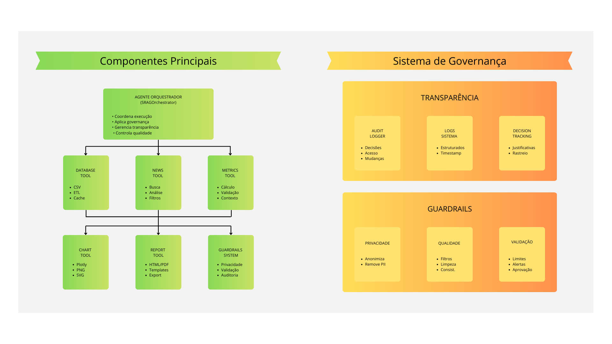
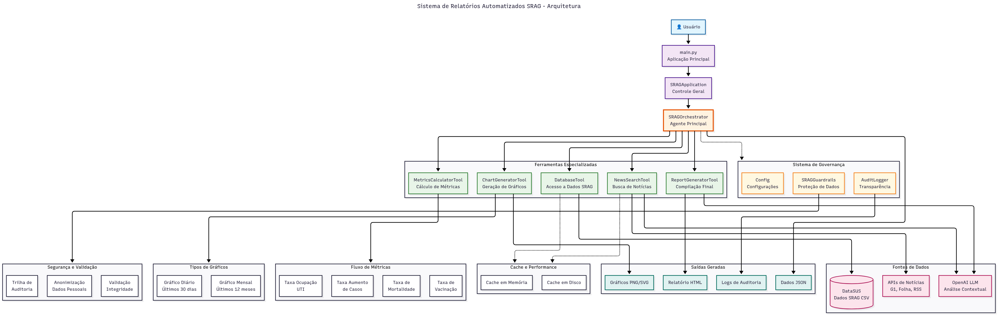

# Sistema de Relatórios Automatizados SRAG

## Visão Geral

Sistema baseado em Inteligência Artificial Generativa para geração automatizada de relatórios sobre Síndrome Respiratória Aguda Grave (SRAG), desenvolvido como Prova de Conceito (PoC) para profissionais da área da saúde.

O sistema consulta dados do DataSUS, calcula métricas epidemiológicas e incorpora análise de notícias em tempo real para fornecer relatórios completos e contextualizados sobre surtos de SRAG.


## Objetivos

- **Automatização**: Geração de relatórios sem intervenção manual
- **Tempo Real**: Incorporação de notícias atuais para contextualizar métricas
- **Métricas Relevantes**: Cálculo de indicadores epidemiológicos essenciais
- **Governança**: Sistema robusto de auditoria e transparência
- **Segurança**: Proteção rigorosa de dados sensíveis de saúde

## Métricas Calculadas

1. **Taxa de Aumento de Casos**: Crescimento percentual comparado ao período anterior
2. **Taxa de Mortalidade**: Percentual de óbitos por SRAG sobre total de casos
3. **Taxa de Ocupação de UTI**: Percentual de casos que necessitaram UTI
4. **Taxa de Vacinação**: Cobertura vacinal da população afetada

## Visualizações

- **Gráfico Diário**: Número de casos nos últimos 30 dias
- **Gráfico Mensal**: Evolução dos casos nos últimos 12 meses

## Arquitetura

### Simplificada



### Detalhada - Diagrama


## Instalação e Configuração

### Pré-requisitos

- Python 3.9+
- pip ou conda
- Git
- Chave da API OpenAI (para LLM) e News API (para as noticias)

### Instalação

```bash
# Clonar o repositório
git clone https://github.com/aryMello/desafio-de-genAI.git
cd desafio-de-genAI

# Criar ambiente virtual
python -m venv venv
source venv/bin/activate  # No Windows: venv\Scripts\activate

# Instalar dependências
pip install -r requirements.txt

# Configurar variáveis de ambiente
cp .env.example .env
# Editar .env com suas configurações
```

### Configuração do .env

```bash
# API Keys
OPENAI_API_KEY=sua_chave_openai_aqui

# News API
NEWS_API_KEY=sua_chave_news_api

# Dados
DATA_PATH=data/raw/srag_data.csv

# Logs
LOG_LEVEL=INFO
LOG_FILE=logs/srag_system.log

# Cache
CACHE_TTL=3600
REDIS_URL=redis://localhost:6379
```

### Download dos Dados SRAG

1. Acesse [OpenDataSUS](https://opendatasus.saude.gov.br/dataset/srag-2021-a-2024)
2. Baixe o arquivo CSV mais recente
3. Coloque em `data/raw/srag_data.csv`

## Uso

### Execução Básica

```bash
# Gerar relatório para hoje
python src/main.py

# Gerar relatório para data específica
python src/main.py --date 2024-03-15

# Apenas verificar status do sistema
python src/main.py --status-only

# Gerar relatório sem gráficos
python src/main.py --no-charts

# Gerar relatório sem análise de notícias
python src/main.py --no-news
```

### Uso Programático

```python
import asyncio
from main import SRAGApplication

async def generate_custom_report():
    app = SRAGApplication()
    
    # Gerar relatório completo
    report = await app.generate_report(
        report_date="2024-03-15",
        include_charts=True,
        include_news=True
    )
    
    print(f"Relatório gerado: {report['metadata']['report_date']}")
    return report

# Executar
report = asyncio.run(generate_custom_report())
```

## Estrutura do Projeto

```
desafio-de-genAI/
├── src/                      # Código fonte
│   ├── agents/               # Agentes de IA
│   │   ├── orchestrator.py      # Orquestrador principal
│   │   └── base_agent.py        # Classe base
│   ├── tools/                # Ferramentas específicas
│   │   ├── database_tool.py     # Acesso a dados
│   │   ├── news_tool.py         # Busca de notícias
│   │   ├── metrics_tool.py      # Cálculo de métricas
│   │   ├── chart_tool.py        # Geração de gráficos
│   │   └── report_tool.py       # Compilação final
│   ├── utils/                # Utilitários
│   │   ├── logger.py            # Sistema de logs
│   │   ├── config.py            # Configurações
│   │   └── guardrails.py        # Sistema de proteção
│   └── config/               # Arquivos de configuração
├── data/                     # Diretório de dados
│   ├── raw/                  # Dados brutos
│   ├── processed/            # Dados processados
│   └── reports/              # Relatórios gerados
├── assets/                   # Arquivos de midia
├── logs/                     # Arquivos de log
├── assets/                   # Arquivos de imagem
├── tests/                    # Testes automatizados
├── docs/                     # Documentação
├── main.py                   # Ponto de entrada
├── requirements.txt          # Dependências
├── LICENSE                   # Licença
└── README.md                 # Este arquivo
```

## Testes

```bash
# Executar todos os testes
pytest

# Testes com cobertura
pytest --cov=src --cov-report=html

# Testes específicos
pytest tests/test_metrics_tool.py

# Testes de integração
pytest tests/test_integration.py -v
```

## Exemplo de Relatório Gerado


```
=====================================
RELATÓRIO SRAG - 2024-03-15
=====================================

MÉTRICAS PRINCIPAIS
• Taxa de Aumento de Casos: +15.3%
• Taxa de Mortalidade: 8.7%
• Taxa de Ocupação UTI: 23.4%
• Taxa de Vacinação: 67.2%

ANÁLISE DE CONTEXTO
Com base nas notícias recentes, o aumento
observado nos casos pode estar relacionado
a mudanças sazonais e flexibilização de
medidas preventivas...

ARQUIVOS GERADOS
• Relatório HTML: reports/srag_2024-03-15.html
• Gráfico Diário: reports/daily_cases_2024-03-15.png
• Gráfico Mensal: reports/monthly_cases_2024-03-15.png
```

## Segurança e Privacidade

### Proteção de Dados Sensíveis

- **Anonimização automática** de dados pessoais identificáveis
- **Agregação geográfica** (apenas estados, não municípios específicos)
- **Generalização de idades** em faixas etárias
- **Remoção de identificadores** únicos

### Auditoria e Transparência

- **Log completo** de todas as decisões dos agentes
- **Rastreamento** de acesso aos dados
- **Timestamping** de todas as operações
- **Assinatura digital** dos relatórios

### Validações Aplicadas

- **Limites de métricas** para detectar valores suspeitos
- **Filtros de qualidade** dos dados de entrada
- **Validação de consistência** temporal
- **Verificação de integridade** dos resultados

## Monitoramento e Logs

### Estrutura de Logs

```json
{
  "timestamp": "2024-03-15T10:30:00Z",
  "level": "INFO",
  "component": "MetricsCalculatorTool",
  "event": "metric_calculated",
  "data": {
    "metric_type": "mortality_rate",
    "value": 8.7,
    "period": "90_days",
    "records_analyzed": 45632
  },
  "execution_id": "exec_20240315_103000"
}
```

### Métricas do Sistema

- **Performance**: Tempo de execução por componente
- **Qualidade**: Taxa de registros filtrados
- **Disponibilidade**: Status de cada ferramenta
- **Acurácia**: Validações de métricas calculadas

## Tratamento de Erros

### Estratégias Implementadas

- **Graceful Degradation**: Sistema continua funcionando mesmo com falhas parciais
- **Retry Logic**: Tentativas automáticas para operações temporariamente falhas
- **Fallback Options**: Alternativas quando componentes estão indisponíveis
- **Error Logging**: Registro detalhado para debugging

### Cenários Cobertos

- Arquivo de dados corrompido ou ausente
- APIs de notícias temporariamente indisponíveis
- Erros de conectividade de rede
- Dados insuficientes para cálculo de métricas
- Falhas na geração de gráficos

## Documentação Adicional

<<<<<<< HEAD
- [Arquitetura Detalhada](docs/architecture_diagram.md)
- [Dicionário de Dados](docs/dicionario-de-dados-2019-a-2025.pdf)
=======
- [Arquitetura Detalhada](./docs/Arquitetura_Tecnica_Detalhada.pdf)
- [Dicionário de Dados](./docs/dicionario-de-dados-2019-a-2025.pdf)
>>>>>>> refs/remotes/origin/main

## Contribuição

### Workflow de Desenvolvimento

1. Fork do repositório
2. Criar branch para feature: `git checkout -b feature/nova-funcionalidade`
3. Implementar mudanças seguindo padrões de Clean Code
4. Adicionar testes apropriados
5. Executar validações: `pytest && black src/ && flake8 src/`
6. Commit com mensagem descritiva
7. Push para branch: `git push origin feature/nova-funcionalidade`
8. Criar Pull Request

### Padrões de Código

- **PEP 8** para estilo de código Python
- **Type Hints** obrigatórias em funções públicas
- **Docstrings** em formato Google para documentação
- **Testes unitários** para novas funcionalidades
- **Cobertura mínima** de 80% nos testes

## Conformidade e Regulamentações

### LGPD (Lei Geral de Proteção de Dados)
- Anonimização automática de dados pessoais
- Logs de acesso para auditoria
- Minimização de dados coletados
- Direito ao esquecimento implementado

### Padrões de Saúde
- Compatibilidade com HL7 FHIR
- Seguimento de diretrizes do MS/DataSUS
- Proteção de informações de saúde (PHI)
- Auditoria conforme normas de vigilância

### FAQ

**Q: O sistema funciona com dados de outros anos?**
A: Sim, desde que os dados estejam no formato padrão do DataSUS.

**Q: É possível personalizar as métricas calculadas?**
A: Sim, através da extensão da classe `MetricsCalculatorTool`.

**Q: Como garantir a privacidade dos dados?**
A: O sistema aplica anonimização automática através do módulo `SRAGGuardrails`.

## Licença

Este projeto está licenciado sob a Licença MIT - veja o arquivo [LICENSE](LICENSE) para detalhes.

## 👥 Equipe

- @aryMello (Ana Melo)
